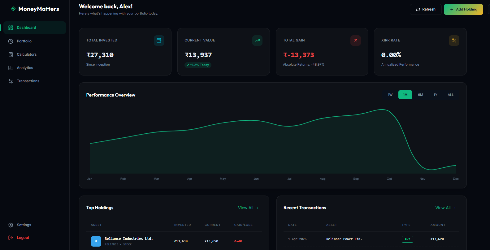
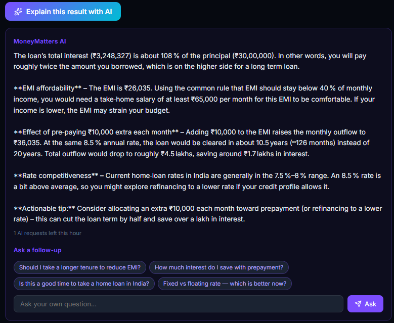

# MoneyMatters

> **A full-stack Indian personal finance platform** combining 10 research-grade financial calculators, a live-priced stock portfolio tracker with XIRR analytics, and an AI advisor powered by **NVIDIA Nemotron** that reads real-time Yahoo Finance fundamentals.

Built as a production-style monorepo: Spring Boot 3.2 / Java 17 backend, React 19 / Vite frontend, Clerk JWT auth, Railway PostgreSQL, and a caching + rate-limiting layer designed for a free-tier LLM budget.


---

## Highlights

- **10 financial calculators** — SIP Step-up, Retirement Planner, Loan EMI Analyzer (with prepayment simulation), Loan Comparison, Asset Allocation Rebalancer, Cashflow Planner, SWP, FD, RD, PPF. All produce charted projections plus amortization/yearly schedules.
- **Live-priced portfolio tracker** — real Yahoo Finance quotes for NSE (`.NS`) and BSE (`.BO`) symbols, auto-refreshed on market hours, with full transaction history (BUY / SELL / DIVIDEND / BONUS / SPLIT) and XIRR / CAGR / realized-vs-unrealized analytics.
- **AI advisor (NVIDIA Nemotron)** — contextual explanations on every calculator result and a full-portfolio analyser that ingests P/E, ROE, 200-DMA, analyst ratings, sector concentration, and XIRR. Returns a structured report with health score, risks, and actionable recommendations, plus a stateless follow-up channel.
- **Production hardening** — per-user sliding-window rate limiter (10 AI req/hr), `@Cacheable` layers for analytics / prices / fundamentals / AI analysis, `BigDecimal`-only financial math, uniform `ApiResponse<T>` envelope, and Clerk JWT validation via Spring Security OAuth2 Resource Server.

---

## Screenshots

### Landing Page


### Dashboard
Portfolio overview with live-priced holdings, asset allocation breakdown, and performance summary.



### AI Explain for Calculator Results
Every calculator has an *Explain this result with AI* button. The LLM receives the inputs and the computed result, returns a plain-English breakdown, and suggests four follow-up questions scoped to that calculator.



---

## Architecture

```
┌──────────────────────┐        ┌────────────────────────────────────┐
│  React 19 + Vite     │        │  Spring Boot 3.2 (Java 17) :8082   │
│  Clerk <SignIn />    │  JWT   │                                    │
│  Axios interceptor   ├───────▶│  Spring Security OAuth2 Resource   │
│  Chart.js dashboards │        │  Server  →  jwt.getSubject()       │
└──────────────────────┘        │                                    │
                                │  ┌──────────────┐  ┌────────────┐  │
                                │  │ calculators/ │  │ portfolio/ │  │
                                │  │ (stateless)  │  │ (stateful) │  │
                                │  └──────────────┘  └─────┬──────┘  │
                                │                          │         │
                                │  ┌──────────────────┐    │         │
                                │  │ ai/              │    │         │
                                │  │ NemotronService  │    │         │
                                │  │ PromptBuilder    │    │         │
                                │  │ RateLimiter      │    │         │
                                │  │ Fundamentals svc │    │         │
                                │  └────────┬─────────┘    │         │
                                │           │              │         │
                                │           ▼              ▼         │
                                │      @Cacheable    JPA/Hibernate   │
                                └───────┬───────────────────┬────────┘
                                        │                   │
                                        ▼                   ▼
                            ┌──────────────────┐   ┌────────────────┐
                            │ NVIDIA NIM API   │   │ Railway        │
                            │ Nemotron chat    │   │ PostgreSQL     │
                            └──────────────────┘   └────────────────┘
                                        ▲
                                        │
                            ┌──────────────────┐
                            │ Yahoo Finance    │
                            │ v8 chart (price) │
                            │ v10 quoteSummary │
                            │ (fundamentals)   │
                            └──────────────────┘
```

### Module layout (backend)

```
com.moneymatters
├── common/          ApiResponse<T>, SecurityConfig, WebConfig (CORS), CacheConfig, GlobalExceptionHandler
├── user/            User entity + UserService (auto-provisions on first JWT request)
├── calculators/     6 stateless endpoints, FinancialMathService (FV/PV/EMI), CalculationUtils (BigDecimal)
├── portfolio/       Holding + Transaction entities, @Cacheable analytics,
│                    @Scheduled price refresh (weekdays 9:15–15:30 IST),
│                    XIRRCalculator (Newton-Raphson)
└── ai/              NemotronService (HttpClient → NVIDIA NIM),
                     MarketFundamentalsService (Yahoo quoteSummary, @Cacheable),
                     AiRateLimiter (per-user sliding window),
                     PromptBuilder (10 calculator + portfolio + follow-up templates),
                     AiPortfolioAnalysisService (@Cacheable(key="#userId"))
```

### Module layout (frontend)

```
frontend/src
├── App.jsx                 ProtectedRoute + Clerk <SignedIn>
├── services/
│   ├── api.js              Axios service layer: holdingApi / txApi / analyticsApi / aiApi
│   └── setupAxiosInterceptor.js   attaches Clerk JWT to every request
├── pages/
│   ├── Dashboard.jsx       Portfolio overview with Chart.js
│   ├── Portfolio.jsx       Holdings CRUD + PortfolioAnalyser
│   ├── Transactions.jsx    Transaction CRUD
│   └── calculators/        10 calculator pages, each with an ExplainButton
└── components/ai/
    ├── ExplainButton.jsx   Shared across all 10 calculators
    └── PortfolioAnalyser.jsx  Collapsible AI card with follow-up input
```

---

## Tech Stack

| Layer         | Choice                                                                  |
| ------------- | ----------------------------------------------------------------------- |
| Backend       | Spring Boot 3.2, Java 17, Spring Security OAuth2 Resource Server        |
| Persistence   | Spring Data JPA + Hibernate 6, PostgreSQL (Railway, prod), H2 (dev)     |
| Frontend      | React 19, Vite, React Router, Chart.js, lucide-react                    |
| Auth          | Clerk (frontend) + JWT validation against Clerk JWKS (backend)          |
| AI            | NVIDIA NIM API (Nemotron model), OpenAI-compatible chat completions     |
| Market data   | Yahoo Finance v8 `chart` + v10 `quoteSummary`                           |
| Caching       | `@Cacheable` / `ConcurrentMapCacheManager` (portfolioAnalytics, stockPrices, stockFundamentals, aiPortfolioAnalysis) |
| Rate limiting | Custom in-memory sliding-window limiter (per-user, 1-hour window)       |
| Financial math| `BigDecimal` with `RoundingMode.HALF_UP` — no floats anywhere           |
| Scheduling    | `@Scheduled` price refresh, IST market hours aware                      |

---

## Engineering Decisions Worth Calling Out

- **Identity comes from the JWT, never the URL.** Controllers use `@AuthenticationPrincipal Jwt jwt` and extract `jwt.getSubject()` — no `userId` path param anywhere. `UserService.ensureUserExists()` auto-provisions the row on first request.
- **`@Cacheable` extracted into its own service.** Spring AOP doesn't intercept self-invocation, so the cached `analyse(userId)` method lives on `AiPortfolioAnalysisService` rather than the controller it's called from — a subtle bug that's easy to miss.
- **`BigDecimal` all the way down.** Every monetary value in the calculator/portfolio modules uses `BigDecimal`, not `double`. XIRR uses Newton-Raphson over `BigDecimal`.
- **Rate limiting at the service boundary.** `AiRateLimiter.checkAndConsume(userId)` throws a custom exception translated to HTTP 429 + `Retry-After` header by `GlobalExceptionHandler`. The frontend renders a human-readable "hit the AI limit — try again in ~N min" message.
- **AI prompts live in one place.** `PromptBuilder` owns all 10 calculator templates, the portfolio prompt (which renders live PE / ROE / 200-DMA / analyst target for each holding), and the two follow-up system prompts. Context is truncated at 3000 chars to stay inside the token budget.
- **Fail-soft over fail-fast for external calls.** `NemotronService` catches every exception and returns a user-visible fallback string instead of 500ing the request. Yahoo fundamentals failures for individual symbols are swallowed per-symbol so a single stale ticker doesn't break the whole analysis.
- **No Flyway (yet).** Schema is managed by `ddl-auto: update`. H2 resets on restart in dev; Railway PostgreSQL persists in prod.

---

## Running Locally

### Prerequisites
- JDK 17+
- Node 18+
- Maven (the `mvnw` wrapper is gitignored — use system `mvn`)
- A Clerk application (publishable + secret keys, JWKS URL)
- An NVIDIA NIM API key ([build.nvidia.com](https://build.nvidia.com)) — free tier works
- A Railway PostgreSQL URL *(optional — H2 is used if unset)*

### 1. Configure environment

Copy `.env.example` to `.env` at the repo root and fill in:

```dotenv
SPRING_DATASOURCE_URL=jdbc:postgresql://<host>:<port>/<db>
SPRING_DATASOURCE_USERNAME=<user>
SPRING_DATASOURCE_PASSWORD=<password>

CLERK_JWK_SET_URI=https://<your-clerk-domain>/.well-known/jwks.json
CLERK_ISSUER_URI=https://<your-clerk-domain>
CORS_ALLOWED_ORIGINS=http://localhost:5173

NVIDIA_API_KEY=nvapi-xxxxxxxxxxxxxxxxxxxxxxxxxxxxxxxx
AI_MAX_REQUESTS_PER_HOUR=10
```

Frontend — `frontend/.env`:
```dotenv
VITE_CLERK_PUBLISHABLE_KEY=pk_test_xxxxxxxxxxxxx
```

### 2. Start the backend

On Windows (PowerShell), the included helper loads `.env` into the process environment for you:
```powershell
.\run-backend.ps1
```

On macOS / Linux:
```bash
set -a && source .env && set +a
mvn spring-boot:run
```

### 3. Start the frontend

```bash
cd frontend
npm install
npm run dev
```

### Dev URLs
| Service             | URL                                                      |
| ------------------- | -------------------------------------------------------- |
| Frontend            | http://localhost:5173                                    |
| API                 | http://localhost:8082/api                                |
| Swagger UI          | http://localhost:8082/api/swagger-ui/index.html          |
| H2 Console (dev)    | http://localhost:8082/api/h2-console                     |
| Actuator health     | http://localhost:8082/api/actuator/health                |

---

## Testing

```bash
# All backend tests
mvn test

# A specific suite
mvn test -Dtest=SIPCalculatorServiceTest

# A specific test method
mvn test -Dtest=SIPCalculatorServiceTest#testBasicSIPCalculation
```

Integration tests use `SecurityMockMvcRequestPostProcessors.jwt()` to inject a mock Clerk JWT — no real JWKS round-trip needed.

---

## API Quick Reference

Uniform envelope for every response:
```json
{ "success": true, "data": { ... }, "message": "OK", "timestamp": 1700000000000 }
```

### Calculators — `POST /api/v1/calculators/...`
| Endpoint                                | Purpose                                         |
| --------------------------------------- | ----------------------------------------------- |
| `/sip-stepup/calculate`                 | SIP with annual step-up + maturity curve        |
| `/retirement/plan`                      | Inflation-adjusted corpus + required monthly SIP|
| `/loan/analyze`                         | EMI + amortization + prepayment impact          |
| `/loan/compare`                         | Side-by-side loan option comparison             |
| `/asset-allocation/rebalance`           | Drift-aware rebalancing recommendations         |
| `/cashflow/project`                     | Monthly inflow/outflow projection               |
| `/swp/calculate`                        | Systematic withdrawal sustainability            |

FD, RD, and PPF are frontend-only (pure math, no backend round-trip).

### Portfolio — all under `/api/v1/portfolio/`, JWT required
- **Holdings**: `/holdings` (CRUD), `/holdings/user`, `/holdings/user/summary`, `/holdings/user/refresh-prices`
- **Transactions**: `/transactions` (CRUD), `/transactions/user`, `/transactions/user/symbol/{symbol}`
- **Analytics**: `/analytics/user` — XIRR, CAGR, realized/unrealized split, top gainers/losers (cached per `userId`)
- **Prices**: `/prices/current/{symbol}`, `/prices/details/{symbol}`, `/prices/update/user`

### AI — `POST /api/v1/ai/...`
| Endpoint              | Purpose                                                     |
| --------------------- | ----------------------------------------------------------- |
| `/explain-calculator` | Plain-English breakdown + 4 follow-up suggestions           |
| `/analyse-portfolio`  | Structured analysis over live fundamentals (cached 15 min)  |
| `/followup`           | Stateless follow-up (topic + context + question)            |
| `/quota`              | Remaining AI requests in the current hour                   |

Rate limit: **10 req/user/hour**. Exceeding returns HTTP 429 with a `Retry-After` header.

Full request/response shapes are in Swagger UI. Selected detail below.

---

## Detailed API Reference

### SIP Step-up Calculator

**Endpoint** `POST /api/v1/calculators/sip-stepup/calculate`

**Request**
```json
{
  "monthlySIP": 10000,
  "expectedAnnualReturnPercent": 12,
  "years": 3,
  "annualStepupPercent": 10
}
```

**Response**
```json
{
  "success": true,
  "data": {
    "totalInvested": 397200.00,
    "maturityValue": 468740.35,
    "wealthGained": 71540.35,
    "firstYearMonthlySIP": 10000.00,
    "lastYearMonthlySIP": 12100.00,
    "yearlyBreakdown": [
      {
        "year": 1,
        "monthlySIP": 10000.00,
        "yearlyContribution": 120000.00,
        "valueAtYearEnd": 126800.00,
        "valueAtMaturity": 159000.00
      }
    ],
    "maturityCurve": [
      { "label": "Year 1", "value": 159000.00 }
    ]
  },
  "message": "SIP Step-up calculation successful",
  "timestamp": 1700000000000
}
```

### Retirement Planner

**Endpoint** `POST /api/v1/calculators/retirement/plan`

**Request**
```json
{
  "currentAge": 30,
  "retirementAge": 60,
  "lifeExpectancy": 85,
  "currentMonthlyExpense": 50000,
  "expectedInflationPercent": 6,
  "expectedReturnPreRetirementPercent": 12,
  "expectedReturnPostRetirementPercent": 8,
  "existingCorpus": 1000000
}
```

**Response**
```json
{
  "success": true,
  "data": {
    "inflatedMonthlyExpenseAtRetirement": 287174.56,
    "inflatedAnnualExpenseAtRetirement": 3446094.72,
    "requiredCorpusAtRetirement": 37800000.00,
    "projectedExistingCorpusAtRetirement": 29960000.00,
    "corpusShortfall": 7840000.00,
    "recommendedMonthlySIP": 2200.00,
    "totalSIPInvestmentNeeded": 792000.00,
    "yearsToRetirement": 30,
    "yearsInRetirement": 25,
    "preRetirementProjections": [],
    "postRetirementProjections": [],
    "corpusGrowthChart": []
  },
  "message": "Retirement plan calculated successfully"
}
```

### Loan Analyzer

#### Analyze Single Loan

**Endpoint** `POST /api/v1/calculators/loan/analyze`

**Request**
```json
{
  "principal": 500000,
  "annualInterestRatePercent": 10,
  "tenureMonths": 60,
  "prepayments": [
    {
      "atMonth": 12,
      "amount": 50000,
      "option": "REDUCE_TENURE"
    }
  ]
}
```

**Response highlights**
- **EMI**: ₹10,624
- **Total Interest**: ₹1,14,742 (after prepayment savings)
- **Full amortization schedule**: 54 monthly breakdowns (reduced from 60)
- **Prepayment Impact**:
  - Tenure reduced by 6 months
  - Interest saved: ₹22,669
  - Original total cost: ₹6,37,411
  - New total cost: ₹6,14,742

**Response structure**
```json
{
  "success": true,
  "data": {
    "emi": 10623.52,
    "totalAmountPayable": 614742.16,
    "totalInterestPayable": 114742.16,
    "effectiveTenureMonths": 54,
    "principal": 500000.00,
    "interestToLoanPercentage": 22.95,
    "amortizationSchedule": [
      {
        "month": 1,
        "emi": 10623.52,
        "principalPaid": 6456.85,
        "interestPaid": 4166.67,
        "prepaymentAmount": 0.00,
        "closingBalance": 493543.15
      }
    ],
    "prepaymentImpact": {
      "totalPrepaymentAmount": 50000.00,
      "interestSaved": 22669.16,
      "monthsSaved": 6,
      "newEMI": 10623.52,
      "originalTotalCost": 637411.20,
      "newTotalCost": 614742.16
    },
    "principalVsInterestChart": [],
    "balanceOverTimeChart": []
  },
  "message": "Loan analysis completed successfully"
}
```

**Prepayment options**
- `REDUCE_TENURE` — keep EMI same, reduce loan duration
- `REDUCE_EMI` — keep tenure same, reduce monthly EMI

---

### Portfolio Holdings

> All portfolio endpoints authenticate the user from the Clerk JWT Bearer token. `userId` is **not** passed in the URL or body — it is extracted from `jwt.getSubject()` server-side.

#### Create Holding

**Endpoint** `POST /api/v1/portfolio/holdings`

**Request**
```json
{
  "assetType": "STOCK",
  "assetName": "Reliance Industries",
  "assetSymbol": "RELIANCE",
  "exchange": "NSE",
  "quantity": 10,
  "avgBuyPrice": 2800.50,
  "purchaseDate": "2024-01-15"
}
```

**Asset types**: `STOCK`, `MUTUAL_FUND`, `ETF`, `BOND`, `GOLD`

**Response**
```json
{
  "success": true,
  "data": {
    "id": 1,
    "assetType": "STOCK",
    "assetName": "Reliance Industries",
    "assetSymbol": "RELIANCE",
    "exchange": "NSE",
    "quantity": 10.0000,
    "avgBuyPrice": 2800.50,
    "totalInvested": 28005.00,
    "currentPrice": 1453.60,
    "currentValue": 14536.00,
    "unrealizedGain": -13469.00,
    "unrealizedGainPercent": -48.0950,
    "purchaseDate": "2024-01-15",
    "lastUpdated": "2026-02-12T12:42:53.18379"
  },
  "message": "Holding created successfully",
  "timestamp": 1770880455574
}
```

#### Get Single Holding
`GET /api/v1/portfolio/holdings/{id}`

#### List User Holdings
`GET /api/v1/portfolio/holdings/user`

```json
{
  "success": true,
  "data": [
    {
      "id": 1,
      "assetType": "STOCK",
      "assetName": "Reliance Industries",
      "assetSymbol": "RELIANCE",
      "exchange": "NSE",
      "quantity": 10.0000,
      "avgBuyPrice": 2800.50,
      "totalInvested": 28005.00,
      "currentPrice": 1453.60,
      "currentValue": 14536.00,
      "unrealizedGain": -13469.00,
      "unrealizedGainPercent": -48.0950,
      "purchaseDate": "2024-01-15",
      "lastUpdated": "2026-02-12T12:42:53.18379"
    },
    {
      "id": 2,
      "assetType": "STOCK",
      "assetName": "Tata Consultancy Services",
      "assetSymbol": "TCS",
      "exchange": "BSE",
      "quantity": 5.0000,
      "avgBuyPrice": 3500.00,
      "totalInvested": 17500.00,
      "currentPrice": 2766.40,
      "currentValue": 13832.00,
      "unrealizedGain": -3668.00,
      "unrealizedGainPercent": -20.9600,
      "purchaseDate": "2024-02-10",
      "lastUpdated": "2026-02-12T12:44:15.571605"
    }
  ],
  "message": "2 holdings found",
  "timestamp": 1770880437922
}
```

#### Update Holding
`PUT /api/v1/portfolio/holdings/{id}` — same body as create.

#### Delete Holding
`DELETE /api/v1/portfolio/holdings/{id}`

#### Portfolio Summary
`GET /api/v1/portfolio/holdings/user/summary`

```json
{
  "success": true,
  "data": {
    "totalInvested": 45505.00,
    "totalCurrentValue": 28368.00,
    "totalUnrealizedGain": -17137.00,
    "totalUnrealizedGainPercent": -37.6596,
    "totalHoldings": 2,
    "holdings": [],
    "assetTypeBreakdown": [
      {
        "assetType": "STOCK",
        "totalInvested": 45505.00,
        "currentValue": 28368.00,
        "allocation": 100.00,
        "count": 2
      }
    ]
  },
  "message": "Portfolio summary generated successfully",
  "timestamp": 1770880462341
}
```

#### Refresh Prices
- `POST /api/v1/portfolio/holdings/{id}/refresh-price` — single holding
- `POST /api/v1/portfolio/holdings/user/refresh-prices` — all holdings

---

### Stock Prices

#### Current Price
`GET /api/v1/portfolio/prices/current/{symbol}?exchange={exchange}`

Example: `GET /api/v1/portfolio/prices/current/RELIANCE?exchange=NSE`

```json
{
  "success": true,
  "data": { "symbol": "RELIANCE", "price": 1458.50 },
  "message": "Price fetched successfully",
  "timestamp": 1770730428670
}
```

#### Stock Details
`GET /api/v1/portfolio/prices/details/{symbol}?exchange={exchange}`

```json
{
  "success": true,
  "data": {
    "symbol": "TCS.BO",
    "name": "Tata Consultancy Services Limited",
    "currentPrice": 2984.25,
    "previousClose": 2947.10,
    "dayHigh": 3011.00,
    "dayLow": 2943.55,
    "change": 37.15,
    "changePercent": 1.26,
    "volume": 468333,
    "yearHigh": 4040.85,
    "yearLow": 2867.55
  },
  "message": "Stock details fetched successfully",
  "timestamp": 1770730436468
}
```

**Supported exchanges**
- `NSE` — National Stock Exchange (`SYMBOL.NS`)
- `BSE` — Bombay Stock Exchange (`CODE.BO`)

**Examples**: `RELIANCE.NS`, `TCS.BO`, `INFY.NS`, `HDFCBANK.NS` — see [INDIAN_STOCK_SYMBOLS.md](INDIAN_STOCK_SYMBOLS.md) for the full NSE/BSE reference.

---

## Known Gaps (being honest)

- **Transaction reversal is stubbed** — deleting a transaction doesn't roll back its effect on the holding.
- **Date-range analytics** ignores the date params and returns full analytics (tracked).
- **Dashboard growth chart** uses simulated historical values, not real snapshots.
- **Settings page** is routed but empty.
- **No Flyway/Liquibase** — schema managed by `ddl-auto: update`.

These are intentionally left visible rather than papered over.

---

## Project Layout

```
FinProject/
├── src/main/java/com/moneymatters/   Backend source
├── src/main/resources/application.yml
├── src/test/                          JUnit + Spring MockMvc tests
├── frontend/                          Vite + React 19 app
├── docs/screenshots/                  Images used by this README
├── run-backend.ps1                    Loads .env into PowerShell, runs mvn
├── CLAUDE.md                          Contributor / AI assistant guide
├── INDIAN_STOCK_SYMBOLS.md            NSE/BSE symbol reference
└── README.md                          You are here
```

---

## Author

**Mayank Gautam** — built as a self-directed full-stack project combining backend engineering, financial modeling, and applied LLM integration.
